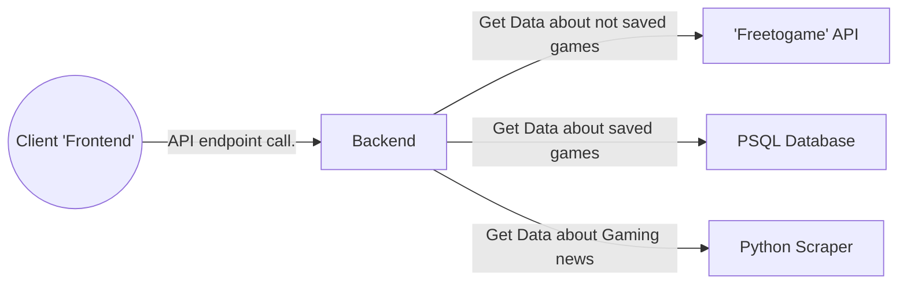

# FAM-backend

This is the frontend side of my interesting PET project.  
For the other parts, please use the following links:

- [Backend](https://github.com/csipkek98/FAM-backend)
- [Scraper](https://github.com/csipkek98/FAM-scraper)

## About the project
The project is meant to be a "home page" for my friend group. It contains a News page, where we can find news related to gaming and a "Free game" page, where I use an API to get data from games that are free to play.

## Project structure

Presentation flowchart with a simple request on the backend

## About Frontend

For this project, I tried myself out with **Angular**. I've never used it before and because of this I worked very slow with it.   
Furthermore, I used **SASS** for CSS, **HTML** as template and in Angular of course I used **Typescript**

## News page

This page is used to show us recent gaming related news from two different sources (IGN and Gamestar). I scrape them down time to time to show this data and I get it from the backend part of the application (but more about this on the [scaper's github page](https://github.com/csipkek98/FAM-scraper))

  

As you can see, I show the data in little cards (Title, timestamp, description.. etc) and if we click the thumbnails, we can read about the whole article on their related websites

## Free Games page

On this page we get the data from the 'freetogame' API fully. Here we can filter on the games to get what games we desire

Here you can see all the games without filtering. If we click the thumbnails of the different games, we get to the store pages of them, where we can start the download process or read more about the games.  
If we want to get more details or pictures of the various games we can press the big green "**MORE INFO**" buttons of the related cards

On this picture we filtered to "3d pve racing" games and pressed the "Search" button on the bottom of the filter. With this, we started an API call to the backend with this parameters and got back the desired data

## Detailed Game page

Here, we show the detailed page of the choosen game. We take the route "/game/{Game_ID}", to send a specific ID to the backend and get the detailed info of the game.  
If we are the first on this game's detail page, we get the data from the API "directly" to show (but more about this on the [backend's github page](https://github.com/csipkek98/FAM-backend))

As you see, we get lots of information about the game from publisher, to screenshots and System requirements. The look is currently work in progress, so it is subject to change.

If we get no System requirements for a game (like in the case of Multiversus), we show the following text instead. (This is work in progress too)

If we look at a webbrowser game, then we get the following text instead, because browser games have minimal system requirements

## All page

In every case, if we are waiting for the fetch to happen from the backend, we show a little loading circle until it is done. The loading takes visible long time on the free game page, thus it's the most demonstratable

